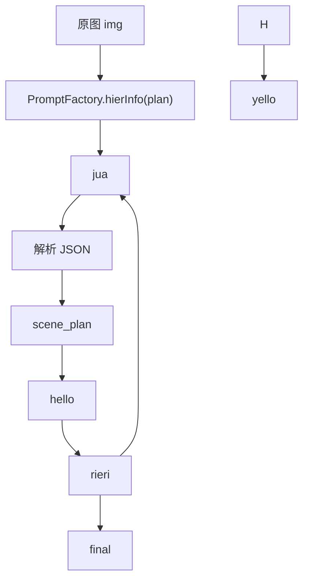

hi
a
b
c

```mermaid
flowchart TD
    A["原图 img"] --> B["PromptFactory.hierInfo(plan)"]
    B --> C["VLM"]
    C --> D["解析 JSON"]
    D --> E["scene_plan"]
    E --> F["hello"]
    F --> G["rieri"]
    H --> I["yello"]
    G --> C["jua"]
    G --> Z["final"]
```

a
b
c
d
3
f
t
g
z
d
b
d
nihao1
